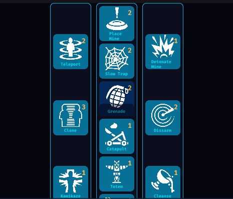

### Game Documentation

#### Game Preview and Camera Control

Players can preview the game while choosing settings or opting to play. Tapping anywhere on the screen will allow players to change the camera’s position, simulating surveillance cameras recording events around the environment.

---

### Settings Panel

When the "Settings" section is selected, a panel will open, allowing players to adjust the following game configurations:

#### 1. **Preset**

Preset configurations are preloaded settings for map size, level configurations, gameplay, and gear. Available options include:

- Menu
- Small
- Medium
- Large
- Random

#### 2. **Level**

##### a. **Seed**

Change the map seed to generate a new random layout.

##### b. **Width**

Adjust the map width with a range of 3 to 8.

##### c. **Length**

Adjust the map length with a range of 3 to 8.

##### d. **Tile Size (X, Y)**

Defines the physical size of each grid cell (floor):

- **Tile Size X:** Width of each cell.
- **Tile Size Y:** Length of each cell.

**Visualization:**

```
    tile_size.x
  ┌──────────┐
  │          │
  │          │ tile_size.y
  │          │
  └──────────┘
```

- **Examples:**

**Tile Size (1,1)**
┌─┬─┬─┐
├─┼─┼─┤
└─┴─┴─┘
3x3 grid (3x3 units total).

**Tile Size (2,1)**
┌──┬──┬──┐
├──┼──┼──┤
└──┴──┴──┘
3x3 grid (6x3 units total).

**Tile Size (2,2)**
┌──┬──┬──┐
├──┼──┼──┤
└──┴──┴──┘
3x3 grid (6x6 units total).

##### e. **Floor Threshold**

Determines the density of floor generation:

- Low threshold (e.g., 0.2): More floors (denser areas).
- High threshold (e.g., 0.8): Fewer floors (sparser areas).

##### f. **Noise Scale**

Controls the "zoom" of the Perlin noise used for map generation:

- Low scale (e.g., 0.1): Larger, connected areas.
- High scale (e.g., 0.9): Smaller, fragmented patterns.

This directly affects how large or small the connected Floor vs. Empty areas will be. A low scale will create larger, more connected areas, while a high scale will create a more fragmented and detailed pattern.

#### 3. **Gameplay**

##### a. **Number of Teams**

Sets the number of teams in the game:

- Minimum: 1
- Maximum: 4

##### b. **Max NPCs per Team**

Defines the maximum number of NPCs per team:

- Minimum: 1
- Maximum: 4

##### c. **Spawn Rate**

Determines how quickly NPCs spawn (in seconds):

- Range: 0.5 - 60 seconds.

##### d. **Aim Speed**

Controls how fast NPCs aim:

- Range: 2.0 (slow) - 20.0 (fast).

##### e. **Move Speed**

Defines NPC movement speed:

- Range: 4.0 (slow) - 20.0 (fast).

##### f. **Balance**

Controls the restitution of NPCs on collision:

- Range: 50.0 (low bounce) - 200.0 (high bounce).

#### 4. **Gear**

Players can equip gear in up to four slots, each with modifiers that alter gameplay.

**Available Modifiers:**

- Offensive:

  1. **AllDamageBonus:** +50% to all damage.
  2. **ElementalDamageBonus:** +100% to elemental effects.
  3. **BulletDamageBonus:** +80% to projectile damage.
  4. **ItemDamageBonus:** +100% to item damage.

- Defensive:
  1. **AllDamageMitigation:** -20% to all damage received.
  2. **ElementalDamageMitigation:** -20% to elemental damage.
  3. **BulletDamageMitigation:** -20% to projectile damage.
  4. **ItemDamageMitigation:** -20% to item damage.

Modifiers can be combined across slots, with cumulative effects. Damage mitigation cannot reduce damage below zero.

**Buttons:**

- **Apply Changes:** Save configurations.
- **Cancel:** Revert to initial settings.

---

### Gameplay

If we select the Play button we will enter directly to the gameplay.

#### Screen Layout

The screen is divided into two sections:

- **Upper Screen:** Game environment.
- **Lower Screen:** User Interface (UI).


#### UI Elements

- **Health and Shield Bars:** Display player’s status.
- **Score and FPS:** Show current score and game frame rate.

#### Navigation Bar

- **Widgets:** Enable/disable additional UI components by pressing their buttons.


#### Abilities

- **Ability Slots (3):** Use abilities, powers, or weapons with cooldowns for balanced gameplay.



#### Game Statistics

Players can navigate statistics using “<” and “>” buttons:

- **Current Stats:** Default display.
- **Detailed Statistics:** Includes overall performance, individual metrics, ability usage, damage dealt, and damage received.


#### Gear Section

Modify equipped gear slots by toggling “<” and “>” buttons for each slot.


#### Additional Options (Burger Button):

- Start a new game.
- Reset the game.
- Go to settings.
- Exit the game.


